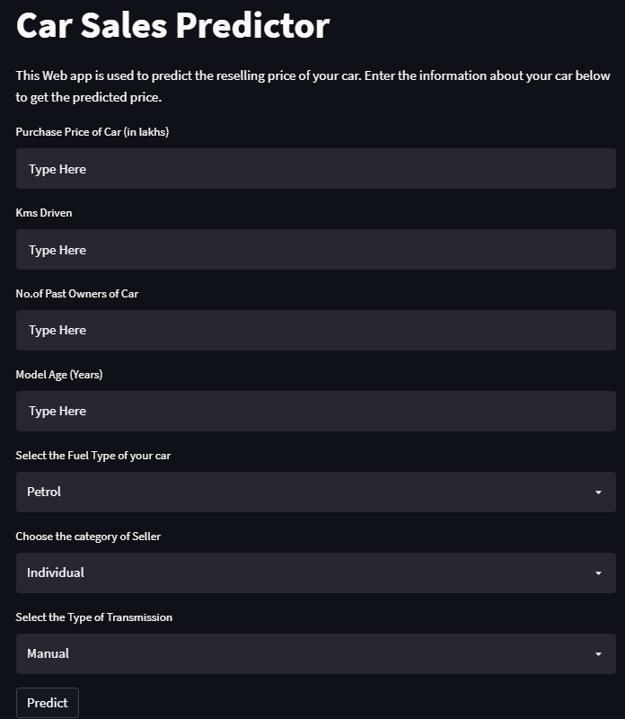
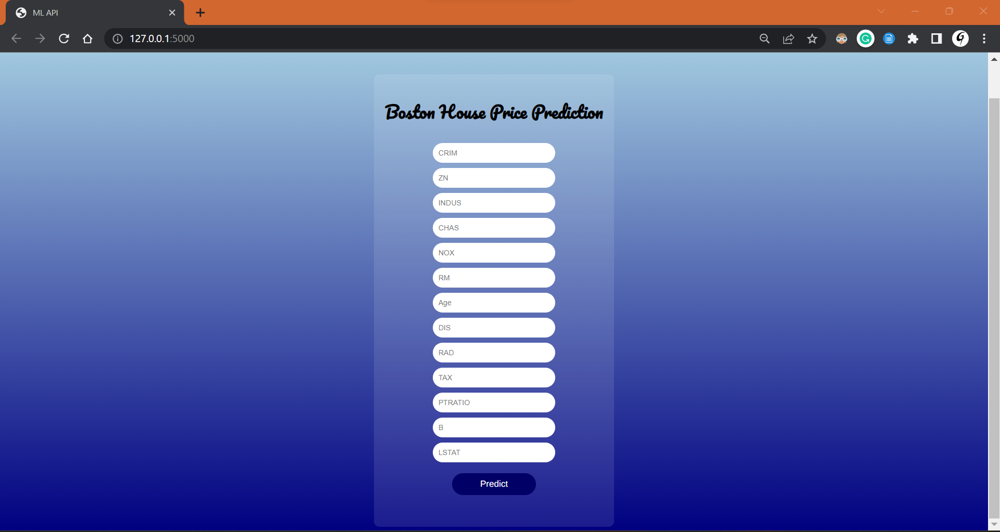

# About me
## I am Gurmanjot Singh , data science & ML enthusiast.
My portfolio demonstrates my proficiency in machine learning, data analysis, and data visualization, utilizing various tools such as Python, PowerBI, SQL, and Tableau. Through projects ranging from predictive modeling to natural language processing, I showcase my expertise in working with structured and unstructured data, and effectively communicating insights to stakeholders. My projects highlight my skills in data preprocessing, feature engineering, and model selection, showcasing my ability to develop robust solutions to complex problems.

# [Project 1: Car sales predictor: Project overview](https://github.com/Gurmancheema/Car-Sales-Predictor-WebApp-using-Random-Forest-Regressor)

- Created a machine learning model to predict the resale value of cars using a dataset from Kaggle
- Explored and experimented with various regression algorithms, and found that the random forest regressor performed the best
- Performed data cleansing, feature engineering, and other operations to improve the accuracy of the model
- Built a client-facing API using Streamlit, which allows users to input car attributes and receive a predicted resale value in return.
- The project aimed to help people understand the value of their used cars and help car dealerships make better pricing decisions.
   

  

# [Project 2: Fake News Classifier: Project overview](https://github.com/Gurmancheema/Fake-News-Classifier)

- Fake News Classifier: Developed a model using Passive Aggressive algorithm with 93% accuracy.
- Kaggle Dataset: Utilized diverse dataset from Kaggle for training and testing.
- Exploratory Data Analysis (EDA): Conducted comprehensive EDA to extract insights and preprocess data.
- Development Tools: Leveraged Visual Studio Code, GitHub, and Postman for efficient development.
- Successful Implementation with Front-End Web Application: Utilized Flask framework to create a user-friendly front-end web application, allowing users to interact with the fake news classifier and receive real-time predictions

  

# [Project 3: Boston House Price Prediction: Project overview](https://github.com/Gurmancheema/BostonHousePricing/tree/main)
- Performed data cleaning tasks, including handling missing values, outliers, and duplicate records. Applied feature engineering techniques to derive new meaningful features.
- Conducted Exploratory Data Analysis (EDA) on the dataset to gain insights into the data distribution, identify patterns, and understand the relationships between features.
- Utilized linear regression, a powerful machine learning algorithm, to build a predictive model for estimating house prices in Boston. Implemented the model using appropriate libraries and frameworks in Python.
- Visualizations such as scatter plots, histograms, and box plots helped in understanding feature distributions, identifying correlations, and detecting potential outliers.
- Deployed the ML model and the Flask web application on the Heroku platform, making it accessible to users over the internet.

  

